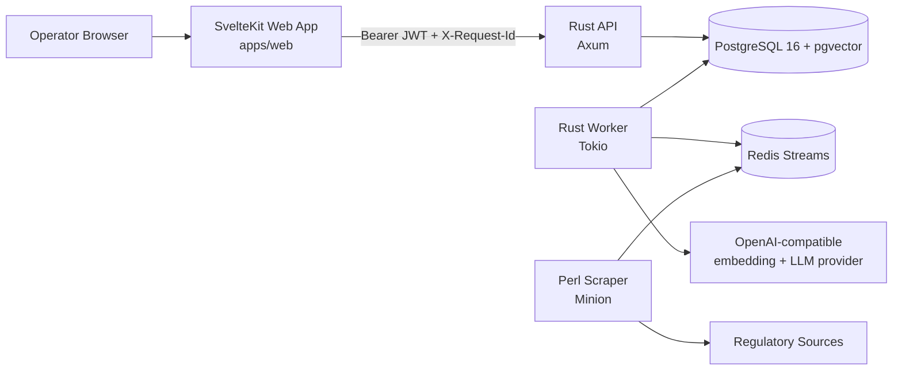

# FiscalBrain-BR

FiscalBrain-BR is a monorepo for a Brazilian tax reform transition platform. It combines tenant-scoped SKU inventory, legal text ingestion, vector retrieval, explainable RAG audits, transition burden forecasting, and split-payment event capture.

The backend is implemented in Rust with Axum, Tokio, `sqlx`, PostgreSQL 16, pgvector, and Redis. The operator UI is a SvelteKit app, and the regulatory scraper is a standalone Perl service.

## What This Repo Contains

| Area | Path | Responsibility |
| --- | --- | --- |
| API | `src/main.rs`, `src/api/` | REST endpoints, JWT validation, tenant resolution, RLS-aware reads and writes |
| Worker | `src/worker/main.rs`, `src/services/` | Redis stream consumers, ingestion pipeline, RAG audit pipeline, scheduled maintenance |
| Web | `apps/web/` | Authenticated SvelteKit UI and backend-for-frontend proxy to the Rust API |
| Scraper | `scraper/` | Polls regulatory sources and publishes ingestion jobs to Redis |
| Database | `migrations/` | Schema, row-level security, explainability, split-payment, and transition calendar |
| Docs | `docs/` | Architecture, data model, API contract, operations, testing, ADRs |

## System Overview



## Product Capabilities

- Tenant-scoped inventory CRUD for reform-impact analysis.
- Transition calendar and effective-rate forecast endpoints for 2026-2033.
- Legal corpus ingestion with chunking, embeddings, and pgvector-backed retrieval.
- Explainable RAG audit artifacts tied to source chunks and audit confidence.
- Append-only audit trail for inventory, ingestion, and rate-generation events.
- Split-payment event capture with idempotency keys and integration status tracking.

## Repository Map

```text
src/
  api/                 Axum routes and middleware
  services/
    audit/             explainability and audit orchestration
    inventory/         SKU CRUD and list filters
    pipeline/          ingestion jobs, chunking, hashing
    rag/               embeddings, vector search, LLM calls
    splitpayment/      split-payment event APIs
    transition/        calendar and effective burden calculations
  worker/              background worker entrypoint
apps/web/              SvelteKit operator UI
scraper/               Perl ingestion publisher
migrations/            PostgreSQL schema and RLS
docs/                  architecture and reference docs
```

## Quick Start

1. Copy the environment file and fill in secrets:

   ```bash
   cp .env.example .env
   ```

2. Set at least these values in `.env`:
   - `DB_PASSWORD`
   - `OPENAI_API_KEY`
   - `APP_SECURITY_JWT_ISSUER_URI` or `APP_SECURITY_JWT_JWK_SET_URI`
   - `APP_SESSION_SECRET`

3. Start the backend services:

   ```bash
   docker compose up --build db redis api worker scraper
   ```

4. Install frontend dependencies and run the web app:

   ```bash
   bun install
   bun --filter web dev
   ```

5. Open the UI and authenticate with a JWT that includes:
   - `tenant_id`
   - `inventory:read`
   - `inventory:write`

## Local Endpoints

| Service | URL |
| --- | --- |
| API health | `http://localhost:8080/actuator/health` |
| Platform info | `http://localhost:8080/api/v1/platform/info` |
| Web UI | `http://localhost:5173` |

## Current Implementation Notes

- The worker has concrete consumers for `queue_ingestion` and `queue_audit`.
- The scraper is the automated producer for ingestion jobs from regulatory sources.
- `POST /api/v1/ingestion/jobs` publishes `IngestionJob` payloads to Redis and records queue state in the audit log.
- `POST /api/v1/inventory/sku/:sku_id/re-audit` publishes `AuditJob` payloads to `queue_audit` and records queue state in the audit log.
- `queue_reporting` is configured in settings but is not yet an active producer/consumer path.

## Useful Commands

```bash
cargo test
bun --filter web test
bun --filter web test:e2e
cd scraper && prove -lr t/
```

## Documentation

- [Architecture](docs/architecture.md)
- [Data Model](docs/data-model.md)
- [API Contract](docs/api-contract.md)
- [Development Guide](docs/development-guide.md)
- [Testing and Quality](docs/testing-quality.md)
- [Operations and Security](docs/operations-security.md)
- [Runbooks and SLOs](docs/runbooks-and-slos.md)
- [ADR-001 Tenant Isolation Baseline](docs/adr-001-tenant-and-traceability-baseline.md)
