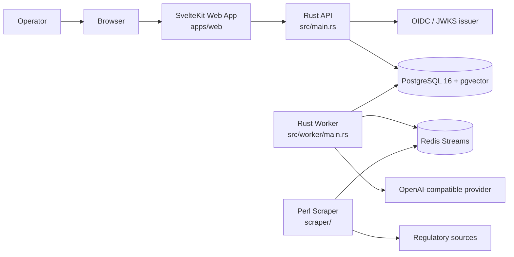
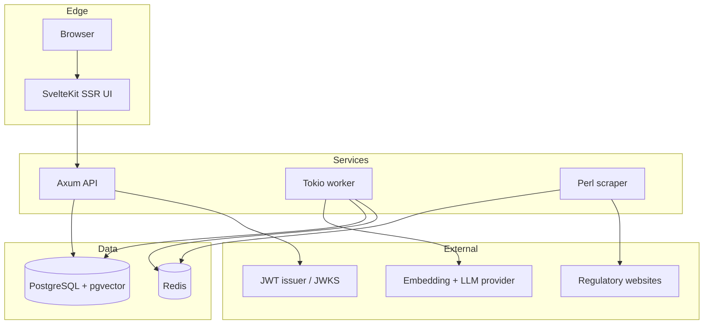
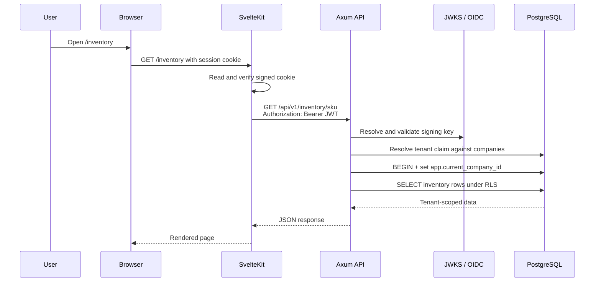
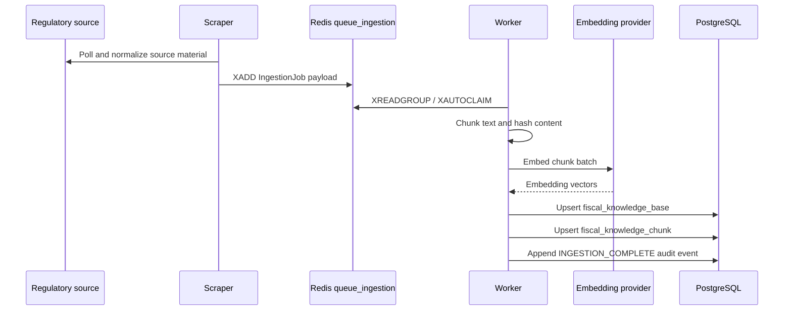
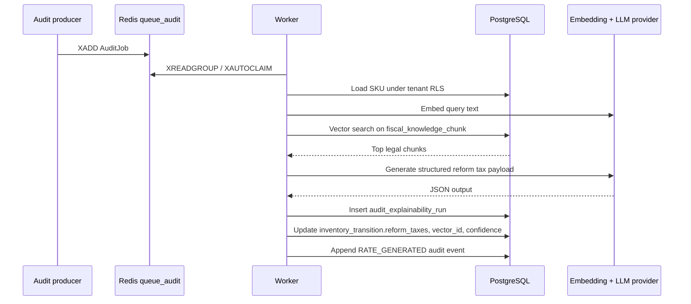
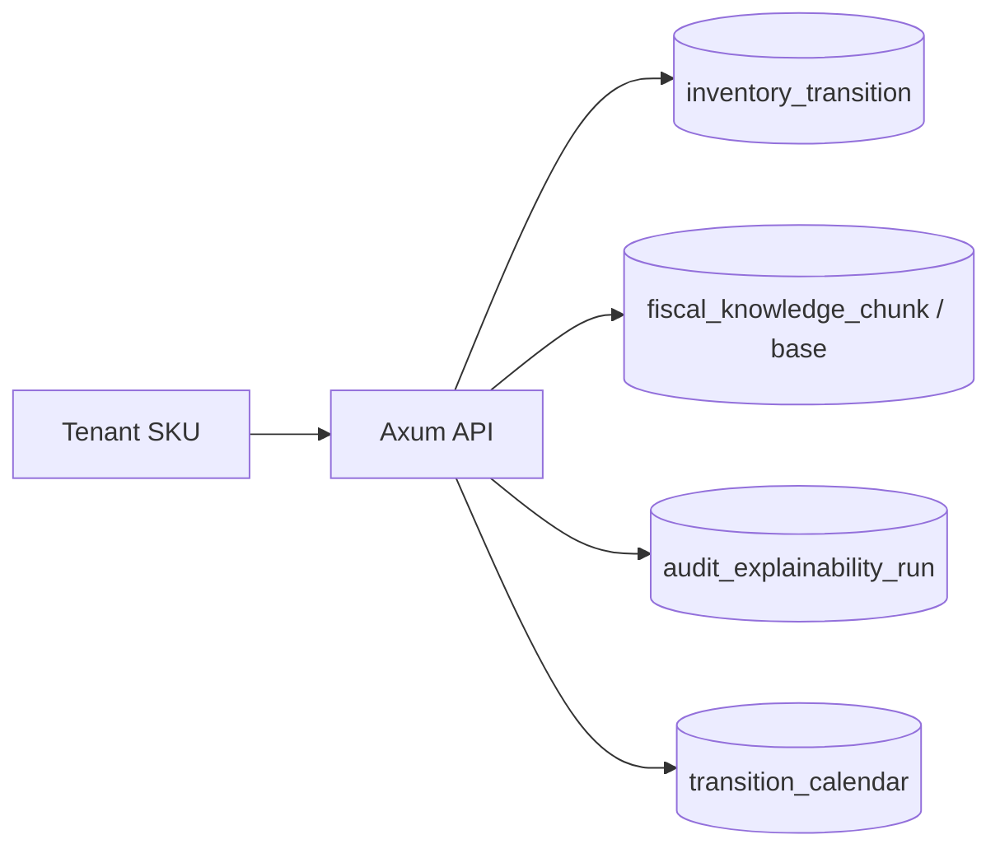

# Architecture

This document reflects the implementation in this repository as of 2026-04-06. It replaces earlier references to Spring Boot and Camel; the current runtime is Rust, SvelteKit, PostgreSQL, Redis, and a standalone Perl scraper.

## Architectural Goals

- Enforce tenant isolation at the application and database layers.
- Preserve explainability for every generated reform-tax result.
- Keep legal ingestion asynchronous and read paths fast.
- Separate tenant-owned operational data from legal-source knowledge data.
- Prefer append-only audit records for traceability.

## System Context

## Runtime Topology

## Containers And Ownership

| Runtime | Code | Role |
| --- | --- | --- |
| Web UI | `apps/web` | Signed session cookie, route protection, SSR page loads, form actions, API proxying with bearer token |
| API | `src/api`, `src/main.rs` | Health endpoints, JWT validation, tenant resolution, inventory, transition, audit, ingestion, split-payment routes |
| Worker | `src/worker/main.rs`, `src/services/*` | Consumes Redis streams, runs embeddings and RAG work, persists explainability artifacts, refreshes reporting state |
| Scraper | `scraper/` | Polls external sources and writes `IngestionJob` payloads to Redis |
| PostgreSQL | `migrations/` | Tenant data, knowledge base, vector chunks, audit trail, explainability, transition tables, split-payment records |
| Redis | configured in `src/config/mod.rs` | Stream transport for ingestion and audit jobs plus retry bookkeeping |

## Core Domain Boundaries

### Tenant Operational Data

- `companies`
- `inventory_transition`
- `split_payment_events`
- `fiscal_audit_log`
- `audit_explainability_run`

These tables are tenant-scoped and accessed through row-level security using `app.current_company_id`.

### Knowledge And Retrieval Data

- `fiscal_knowledge_base`
- `fiscal_knowledge_chunk`

These tables back retrieval and explainability. The worker writes them during ingestion, and audit/query paths read them using pgvector similarity search.

### Reference Data

- `transition_calendar`

This is migration-seeded reference data for the 2026-2033 transition schedule.

## Security And Tenancy Model

- JWT bearer auth is enforced in Axum middleware when `APP_SECURITY_JWT_ENABLED=true`.
- JWKS can be loaded directly or discovered from the issuer metadata endpoint.
- Tenant identity is derived from the verified JWT tenant claim and then checked against `companies`.
- Request handlers open a transaction and call `set_config('app.current_company_id', ...)` before tenant-scoped queries.
- RLS is enabled on tenant-owned tables, and audit-oriented tables are append-only where appropriate.
- The SvelteKit app stores the JWT in a signed, HTTP-only session cookie and forwards it to the API on server-side requests.

## Flow Graphs

### 1. Authenticated Web Request

### 2. Ingestion Pipeline

The ingestion path has two producers: the scraper for automated source polling and the authenticated API endpoint for manual/operator-submitted legislation.

### 3. RAG Audit Execution

The audit worker path is fed by `AuditJob` payloads published to Redis; the manual re-audit endpoint is one of those producers.

### 4. Read-Time Explainability And Forecasting

- `GET /api/v1/audit/explain/:sku_id` reads the stored `vector_id` from `inventory_transition`, then joins back to the knowledge tables to return the legal source behind the last audit.
- `GET /api/v1/audit/explain/:sku_id/artifact/latest` and `GET /api/v1/audit/explain/artifact/runs/:run_id` expose the persisted explainability artifact.
- `GET /api/v1/transition/calendar`, `GET /api/v1/transition/sku/:sku_id/effective-rate`, and `GET /api/v1/transition/sku/:sku_id/forecast` combine `transition_calendar` with stored `legacy_taxes` and `reform_taxes`.

## Data Ownership By Table

| Table | Primary writer | Primary readers |
| --- | --- | --- |
| `inventory_transition` | API inventory routes, worker audit enrichment | API inventory and transition routes |
| `fiscal_knowledge_base` | worker ingestion | worker retrieval, API explain/query joins |
| `fiscal_knowledge_chunk` | worker ingestion | worker retrieval, API explain/query joins |
| `audit_explainability_run` | worker audit path | API compliance/explainability routes |
| `fiscal_audit_log` | API routes and worker | audit/compliance review and traceability |
| `split_payment_events` | split-payment API route | split-payment list endpoint |
| `transition_calendar` | migrations | transition endpoints |

## Queue And Scheduling Model

- `queue_ingestion`
  - Implemented producers: scraper and `POST /api/v1/ingestion/jobs`.
  - Implemented consumer: worker ingestion loop.
- `queue_audit`
  - Implemented producer: `POST /api/v1/inventory/sku/:sku_id/re-audit`.
  - Implemented consumer: worker audit loop.
- `queue_reporting`
  - Configured but not currently used in a live producer/consumer path.
- Scheduled jobs inside the worker:
  - materialized-view refresh timer
  - stale shared-legislation re-ingestion scan
  - worker heartbeat logging

## Known Gaps And Mismatches

- The old docs described a Spring Boot and Apache Camel deployment. That is no longer accurate.
- The current SvelteKit app is a server-side proxy/BFF, not a direct browser-to-API SPA.
- Reporting is timer-driven today; `queue_reporting` is reserved for future background work.

## Operational Notes

- The API runs migrations on startup.
- Redis retry tracking uses dedicated keys per stream message for retry count and retry delay.
- Worker reclaim logic uses `XAUTOCLAIM` to take over idle pending messages.
- Model calls use an OpenAI-compatible base URL and support `MODEL_PROVIDER_MODE=mock` for non-live development paths.

## Where To Go Next

- [Data Model](data-model.md)
- [API Contract](api-contract.md)
- [Development Guide](development-guide.md)
- [Operations and Security](operations-security.md)
- [Runbooks and SLOs](runbooks-and-slos.md)
